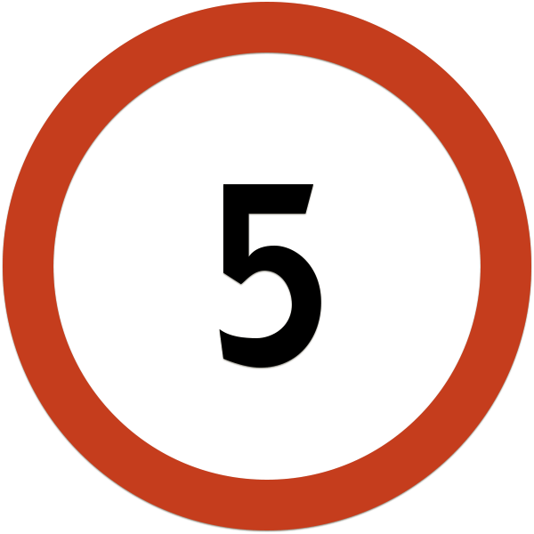

# Аннотация
Незаконченный проект.
Программа для распознавания дорожных знаков ограничений скорости с помощью opencv.

## Поддерживаемые платформы
* Linux 
  * Среда разработки Qt Creator

## Требования:
* qt5-qmake
* OpenCV (версия 3.4.3)
* boost (не ниже версии 1.56)
* tesseract (версия 4.0)

### Загрузка
```
git clone https://gitlab.com/agaltsev.stas/speed-limit-road-signs-detection.git
cd speed-limit-road-signs-detection
```
### Установка с помощью qmake
```
qmake speed-limit-road-signs-detection.pro
make
```
### Запуск
```
cd bin/
./speed-limit-road-signs-detection --help
```

## Запуск распознавания одного дорожного знака
```
./speed-limit-road-signs-detection --mode=image --sign=5 --input=../road_signs/5/1.jpeg

```

## Запуск распознавания папки с дорожными знаками
```
./speed-limit-road-signs-detection --mode=directory --sign=5 --input=../road_signs/5
```

## Пример дорожного знака ограничения скорости 
<p align="center">
</p>

